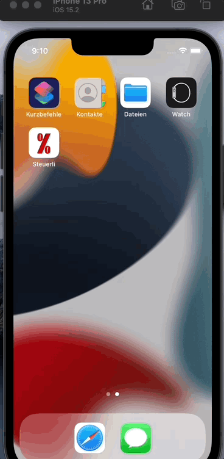

# Steuerli
Steuerli is meant for calculating gross/net prices with a given tax rate.

## Name 
Steuerli is a cutesy way of saying "Steuer" in German, which means taxes. 
It is something that my wife thought of. 

# License 
This app is open source and comes with the MIT license. 
If you decide to use this app, please keep this license in your iteration. 

# Graphics 
The app icon was retrived from (free images)[https://www.freeimages.com/photo/percentage-sign-1147759]

# Requierements 
 This app was tested and created using IOS 15 and should work on any device that supports at least IOS 15.  
 

# Dependencies 
This app was created using Swift and Storyboard. It does not use any extra libraries or have any dependcies. 

# Installation
You can either install the app by running it in a similator or sideloading it onto a device my installing it 

# Usage 
you can calculate the required taxed to be payed for a certain item or the tax that is included in an item. 

## Language 
The app is availabe in both German and English. 
Simply change your phone settings. 

